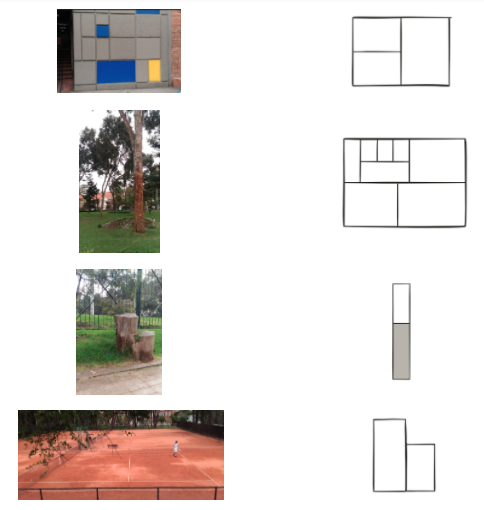

# Augmented Visualizations

Augmented visualizations are the result of taking real objects or places in physical space and turning them into data visualizations without any type of intervention.

Augmented visualizations bring together data, augmented reality and visualizations in a wysiwyg (what you see is what you get) process.

To start with off, let us train our eye to see different visualization types in public space.

Please match the picture on the left with the corresponding pseudoviz:

Although there might be may visualizations that are already there, the real challenge comes when one needs to make them explicit for passerbys to notice and get the message we want to convey.

For this we need three things:

1. Identify the place or space along with its corresponding pseudoviz
2. Create a data visualization for the selected space and pseudoviz.
3. Properly label the embedded visualization.

In the next section we will how we can do that.

