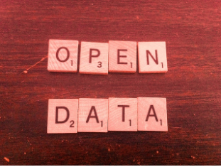

# Presentación

El siglo XXI nos ha sorprendido por la forma vertiginosa y desmedida como han llegado todo tipo de cambios. Desde las relaciones interpersonales, las comunicaciones, la tecnología, los descubrimientos científicos, entre otras. Por esto, la sociedad no puede ser ajena a estas nuevas realidades, su misión es generar cambios para encontrar nuevas formas de relación con la información y permitir la comprensión de nuevos conocimientos entorno a la naturaleza y a la sociedad. 

Simultáneo a esto, la inquietud humana ha servido para descubrir todo tipo de cosas, desde el fuego, la electricidad, la medicina, hasta el internet. Y es precisamente ese espíritu curioso el que ha hecho posible la comprensión de múltiples espacios y procesos que se van gestando desde que se nace. 

No obstante, estamos en tiempos convulsivos donde pulula la congestión de noticias y la desinformación, es por esto que se presenta como urgente promover la comprensión y el desarrollo del pensamiento crítico, donde la apuesta es  potencializar una sociedad que impulse el conocimiento y privilegie la investigación, es de esta manera donde se transforman los procesos de enseñanza-aprendizaje y se puede construir una cultura de paz y ciudadanos integrales.

