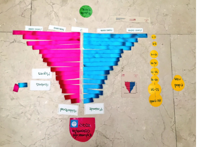

# Introducción:

Estamos viviendo la época más congestionada de la Modernidad en cuanto a información, los datos están inmersos en la sociedad y están por todas partes, los vemos, los escuchamos, los leemos. Esta novedad, ha facilitado la democratización del conocimiento, y se ha posicionado como una revolución cuyo rol fundamental es  aprender a  tomar decisiones y ganar conciencia sobre la información que nos rodea, así como los datos  personales, individuales y colectivos. 

Urbano es una apuesta novedosa que está interesada en utilizar los datos de manera inteligente y eficaz desde el espacio urbano, partiendo de las experiencias digitales que se han tenido desde la interacción con datos. 
Este proyecto, es un esfuerzo para darle a los ciudadanos nuevas herramienta que les permita tomar mejores decisiones informadas a través de la sensibilización en temas de datos y visualización. 

## DATASKETCH URBANO:

Muchas políticas son diseñadas a partir de la intuición y de comparaciones subjetivas. La experiencia es, sin duda, un gran aliado que los humanos utilizamos para sintetizar información cualitativa en el momento de tomar decisiones. Sin embargo, la intuición y la experiencia se verían muy enriquecidas si pudiéramos hacer contrastes con hechos medibles y comparables. 
Es allí donde los datos nos traen un nuevo universo para apoyar la toma de decisiones a diferentes niveles, desde el ciudadano que quiere ver el estado de su entorno en comparación con otros momentos o lugares, hasta el planificador social y constructor de políticas. 
Es una realidad que los datos siguen siendo inalcanzables para el común de los ciudadanos por diferentes razones, entre ellas:
Poca disponibilidad de datos en formatos amigables y procesables.
Falta de educación de la ciudadanía alrededor de los datos.
Carencia de medios que comuniquen conceptos y cifras de manera más visual y menos textual.

## Visualizaciones Callejeras:

El proyecto consiste en entregar a un grupo de ciudadanos kits que contienen diversos materiales junto con muestras de visualizaciones hechas con datos que cuenten diversas problemáticas. Los ciudadanos pueden utilizar cintas, hilos y vinilos para recrear en espacios públicos, como parques, las diferentes visualizaciones.

Este proyecto facilita la interacción y el acercamiento de los ciudadanos con los datos. No sólo de los ciudadanos que activamente recrean las visualizaciones, si no con transeúntes que terminan involucrándose en el proyecto en sí.

Algo interesante del proyecto es que en su misma implementación se está educando de manera lúdica a los ciudadanos en diversos temas del trabajo del día a día con los datos, como son:

Disponibilidad y fiabilidad de las fuentes de información.
Tipos de visualización que pueden usarse para determinados tipos de datos.
Diversidad en maneras de contar historias con datos.
Interacción con la información en tiempo real.

El proyecto fue implementado en su versión inicial en el contexto de la conferencia de datos más importante de América Latina: AbreLatam 2016.

En esta ocasión implementamos a puerta cerrada en la conferencia varias visualizaciones en el salón principal. Se hicieron pirámides poblacionales, líneas de tiempo en relación a la violencia en Colombia, y visualizaciones de problemáticas de género en América Latina. También se repartió el kit Datasketch Urbano entre los asistentes de la conferencia que dejaron su huella de datos en el parque Nacional De Bogotá.

### Visualizaciones Callejeras en el Parque Nacional:

Esta intervención del espacio nos pareció muy interesante, ya que este grupo decidió utilizar las cestas de basura para hacer su visualización

