```{r, echo = FALSE}
library(tidyverse)
```


# Hazlo Tu Mismo

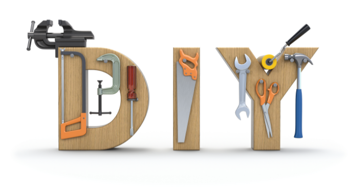


Surgida de la cultura Underground, el Do It Yourself (DIY) o Hazlo Tu Mismo se ha convertido en una forma de creación y distribución cultural con el auge de una tendencia que nos invita a ser creadores, a desarrollar y a fabricar nuestros propios productos. Esta postura se ha convertido en una alternativa a la creación mainstream, ya que nos hemos acostumbrado a tener todo listo para usar, comer, y vestir.  En este sentido, las herramientas digitales han evolucionado y la capacidad de expansión del DIY  es mucho mayor. La creación y esparcimiento de espacios de promoción de diferentes herramientas, las nuevas voces, los nuevos medios, todo esto marca un antes y un después en la nueva cultura digital.


## Intervenciones Públicas


El objetivo de este proyecto es potencializar las intervenciones callejeras y públicas como práctica política. A partir de los  relatos de distintos procesos de intervención callejera y su respectiva presentación en el espacio público podemos pensar en la importancia de los datos para la transformación social, específicamente las visualizaciones e intervenciones en el espacio público. La especificidad que conlleva la intervención en el espacio público, la articulación con la coyuntura actual del país  y la búsqueda por promover la participación  ciudadana pone de manifiesto la clara incidencia de estas prácticas en la vida social cotidiana.

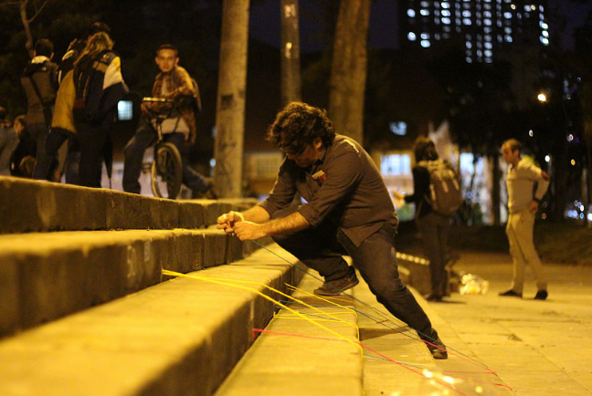


### Materiales

Los tipos de visualización que más fácil se pueden representar en espacio público con materiales sencillos corresponden a las siguientes:

- _Líneas_

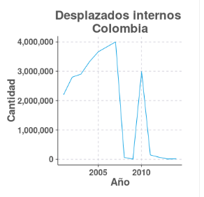

- _Barras_

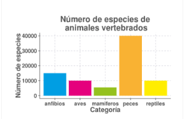

- _Dispersión_ 

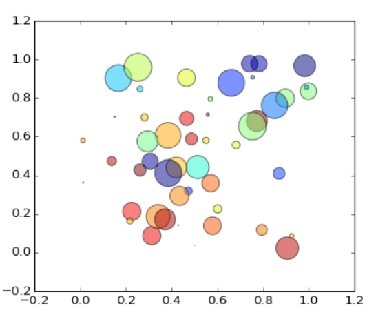

Estas visualizaciones se pueden realizar con los siguientes materiales.

- _Tizas_

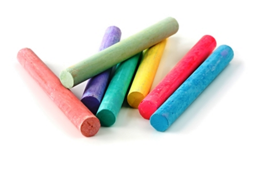

- _Cintas e hilos_

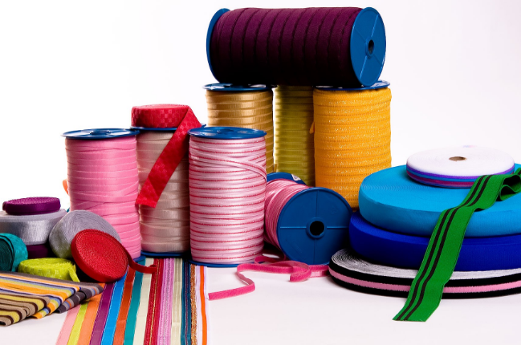

- _Papel_

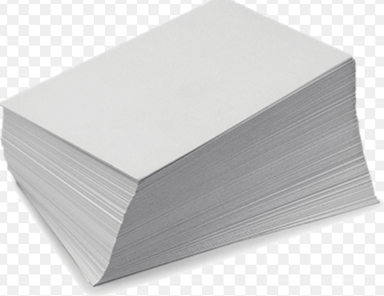

- _Vinilo_

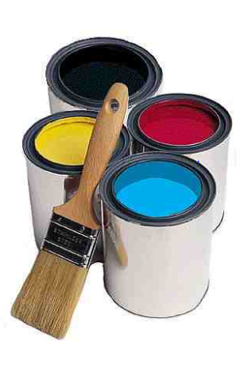

- _Marcadores_

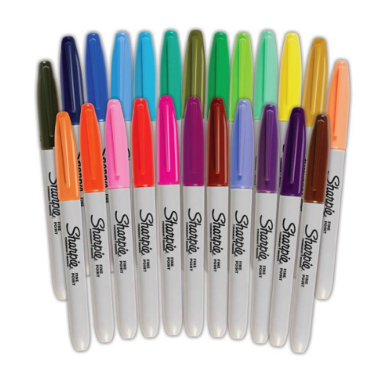

- _Rótulos_

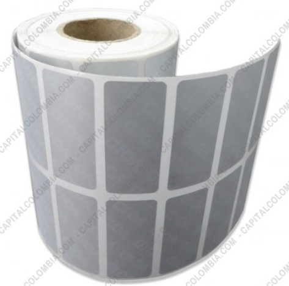


## Ejemplo: Abrelatam 2016

El kit debe contener al menos:
 
- 4 Tizas Blancas
- 4 Tizas de colores aleatorios
- 4 rollos de cinta de 25mm por 5mts de 4 diferentes colores
- 2 rollos de vinilo adhesivo de piezas de 25cmX60cm(ancho material) de colores diferentes
- 1 Tijeras
- 4 Rollos de Lana de diferentes colores
- 1 Rollo de cinta de enmascarar
- 1 Marcador sharpie
- 12 Rótulos blancos de 100mmX53mm
- 5 Visualizaciones impresas
- 1 Instrucción de uso

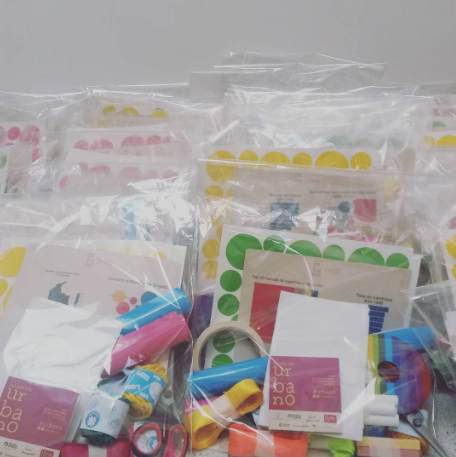


```{r, echo = FALSE, message=FALSE, warning=FALSE,fig.cap='Preparación de kits',fig.align='center', out.width='90%'}
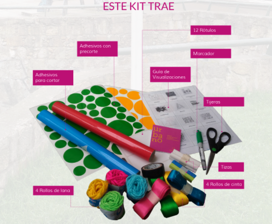
```


Las instrucciones de uso __Instrucciones Urbano__  tamaño carta que describen y dan ejemplos sobre cómo usar el kit, sugerimos imprimir en un papel que tenga un bajo impacto con el medio ambiente en Colombia se conoce éste papel como Earth Pack. 1 día hábil.

__Producción corte vinilo__ Archivo en Illustrator para cortar sobre vinilo adhesivo. Formas prediseñadas que permiten hacer diferentes visualizaciones y deben hacerse en lugares especializados de impresión que tengan el servicio de “Plotter de corte”, éste servicio es común en papelerías y centros de impresión cercanos a Universidades que tienen facultades de Arquitectura, Diseño y Arte ó que se especializan en hacer impresión para publicidad. 3 días hábiles.
Es importante que se le especifique al proveedor los siguientes a y b sugerencias.
a)    El archivo debe ajustarse a escala al tamaño del material, en Colombia es a un ancho de 59cm. Y el corte está diseñado para que se haga en números pares es decir cada 25cm del material saldrán 2 piezas.
b)    En la forma de entrega también ahorrará tiempo si el proveedor se hace cargo de “descartonar”  ó quitar el material sobrante del corte y cortar cada pieza a tamaño 30cmX25cm y entregar listo para hacer el ensamble del kit en caso que no tener en cuenta + 1 día hábil de descartonar y cortar.


#### Preparación de kits

Para la preparación de los kits es necesario averiguar las cantidades por las que vienen los materiales que lo conforman y determinar a partir de cuántas unidades se pueden obtener descuentos (por ejemplo en Colombia los productos se comercializan al por mayor, mínimo por docenas) lo que nos llevó a decidir teniendo en cuenta la cantidad de personas que iban asistir al evento que lo más rentable era producir 100 unidades.

```{r, echo = FALSE, message=FALSE, warning=FALSE,fig.cap='Preparación de kits',fig.align='center', out.width='90%'}
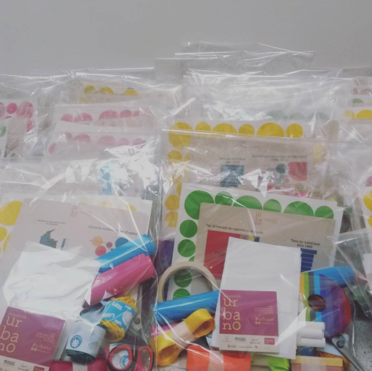
```

La preparación de los kits ocurre en 2 fases:

- Pre-producción (una semana)
  - Estimación de costos y cantidades
  - Materiales
  - Preparacíon de visualizaciones
- Producción (3 días)
  - Impresión de sugerencias de visualización
  - Impresión de instrucciones
  - Corte de vinilo
  - Pre-ensamble
  - Ensamble


La fase de **pre-producción** tomó al menos 3 días hábiles. Se debe decidir sobre:

- Cantidad de kits a producir
- Materiales a incluir
- Cantidades de cada uno de los materiales

El proceso para la toma de estas decisiones es iterativo. Se inicia con un presupuesto inicial, se cotizan materiales y se revisan las cantidades. Recuerde que normalmente cuantas más cantidades se tengan de los materiales, más económica sale su implementación.

```{r table-materiales, echo = FALSE, message=FALSE, warning=FALSE, tidy=FALSE}
materiales <- read_csv("assets/02/precios-materiales.csv")

knitr::kable(
  materiales, booktabs = TRUE,
  caption = 'Precios aproximados de materiales por kit para Colombia'
)
```

La fase de **producción** toma al menos 3 días. Se debe tener en cuenta los tiempos de impresión de los diferentes proveedores.

"UrbanoVizToPrint" visualizaciones por Kit aleatorias para empacar dentro de cada kit 5 hojas carta , sugerimos imprimir en un papel que tenga un bajo impacto con el medio ambiente en Colombia se conoce éste papel como Earth Pack. 2 días.

"Instrucciones Urbano" Instrucciones tamaño carta que describen y dan ejemplos sobre cómo usar el kit, sugerimos imprimir en un papel que tenga un bajo impacto con el medio ambiente en Colombia se conoce éste papel como Earth Pack. 1 día hábil

"Producción corte vinilo" Archivo en Illustrator para cortar sobre vinilo adhesivo. Formas prediseñadas que permiten hacer diferentes visualizaciones y deben hacerse en lugares especializados de impresión que tengan el servicio de “Plotter de corte”, éste servicio es común en papelerías y centros de impresión cercanos a Universidades que tienen facultades de Arquitectura, Diseño y Arte ó que se especializan en hacer impresión para publicidad. _3 días_.
 
Es importante ajustar el archivo al tamaño del material, en Colombia trabajamos con vinilos de 59cm de ancho. El corte está diseñado para hacerse cada 25cm. Es necesario "descartonar" los vinilos, es decir, remover el adhesivo sobrante que no se va a utilizar. _1 día_.

```{r, echo = FALSE, message=FALSE, warning=FALSE,fig.cap='Preparación de kits',fig.align='center', out.width='90%'}
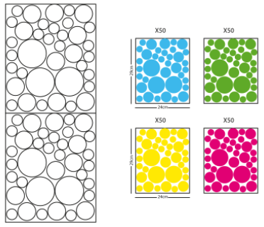
```

Una vez están los archivos en producción aconsejamos avanzar en el pre-ensamble que toma un tiempo en nuestro caso logramos tener un equipo de 8 personas para hacer el pre-ensamble de 100 kits. Medio día.

En el pre-ensamble se prepararon para cada kit:

1. Tizas Blancas: Paquete de 4 tizas por kit juntándolas con cinta de enmascarar o masking tape.
2. Tizas de colores. Paquete de 4 tizas de diferentes colores  por kit juntándolas con cinta de enmascarar.
3. Cinta de tela de diferentes colores: Cortar las cintas cada  5m, enrollar cada pedazo y pegar el rollo con cinta de enmascarar. Us4 colores por kit
4. Vinilo Adhesivo: Cortar piezas cada 25cm por el ancho del material y envolver por el sentido más pequeño asegurar con cinta de enmascarar
5. Lana de colores: Separar por colores para el ensamble
6. Rótulos blancos: Separar rótulos cada 12 unidades
 
Organizar los materiales por estaciones de tal manera que comience en la bolsa, la idea es que tengan personas por estación y la bolsa vaya rotando alrededor del los materiales hasta concluir con el cierre

Ensamble de kits

Organizar los materiales por estaciones de tal manera que comience en la bolsa, la idea es que tengan personas por estación y la bolsa vaya rotando alrededor del los materiales hasta concluir con el cierre.

#### Archivos de soporte

- Instrucciones (disponible en http://example.com)
- Muestras de visualizaciones (disponible en http://example.com)
- Corte vinilos circulares


#### El evento

La actividad está diseñada para que tenga una duración de aproximadamente 3 hrs
De la siguiente manera:
 
Aconsejamos se haga con luz día para tener un buen registro fotográfico y las visualizaciones sean visibles.


```{r, echo = FALSE, message=FALSE, warning=FALSE,fig.cap='Preparación de kits',fig.align='center', out.width='90%'}

```


10 minutos de introducción
5 minutos para que las personas se organicen en grupos de 3 personas y repartir 1 kit por cada grupo de 3-5 personas
1-1 ½  hrs para realizar las visualizaciones que contiene el kit
15 min para que los grupos hagan registro fotográfico con sus intervenciones
30 min para recorrer las visualizaciones de los otros grupos
30 min para hacer limpieza del espacio donde se hicieron las visualizaciones (a menos que tengan el permiso para dejarlas en el espacio)
 
Si la actividad va a realizarse en espacio público es importante recomendar a los participantes sobre mantener los objetos personales a la vista y en un lugar seguro, para evitar experiencias desagradables como la pérdida o robo de objetos personales. 

Durante la experiencia en Bogotá contamos con un Staff de 8 personas para aproximadamente 25 grupos, es recomendable tener 1 persona de Staff cada máximo 5 grupos.


Es importante que el Staff tenga un distintivo para que las personas puedan identificarlos con facilidad durante la actividad.
 
El Staff debe acompañar la actividad, no debe hacerla, es decir, debe dar ideas con el kit sobre que podrían intervenir, dar puntos de partida como por ejemplo decirle a los grupos: -acerquémonos a las escaleras para hacer una visualización de barras o líneas en tal árbol. Es importante que anime al grupo a usar los materiales pero una vez el grupo ya está organizado y sabe lo que debe hacer seguir con lo demás, y pasar de vez en cuando a preguntar si necesitan algo más y si todo está en orden y tratar de animar a que hagan más de una visualización. También animar a que hagan un registro fotográfico y que suban a redes sociales con el hashtag #vizurbano

Registro Fotográfico: Para el registro fotográfico recomendamos que se tomen fotos del kit y los diferentes materiales en uso, es decir tratar de registrar el producto con los participantes de la actividad, y un registro general de las visualizaciones logradas con el kit.

Ejemplo:
Fotos flickr https://www.flickr.com/photos/129056520@N08/

### Aprendizajes


## Otras intervenciones

Para realizar otros tipos de intervenciones usando cualquier tipo de objetos se pueden organizar los objetos por tamaños colores y formas.

### Hogar


### Supermercado

### Restaurante

### Tiendas


<!--

## NOTES

These are step by step instructions to build your own urban visualizations.

1. Select your favorite topic.
2. Select and prepare the data.
3. Build you visualization with any visualization software.
4. Find a place to build your visualization.
5. Prepare the materials.
6. Go and buid it

You can build your urban visualization in different places. It could be outdoors or indoors, here is a list of some of the available options.

- Outdoors
    + Parks
    + Streets
    + Building facades
- Indoors
    + Home
    + Supermarket
    + Retail store

-->


