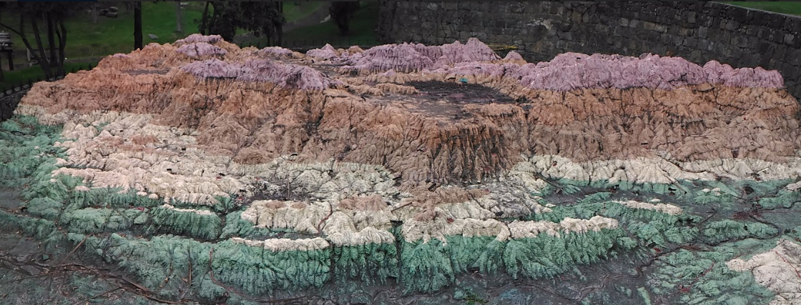

# Visualizaciones Aumentadas


Las visualizaciones aumentadas son el resultado de tomar objetos o lugares reales en el espacio físico y convertirlos en visualizaciones de datos sin ningún tipo de intervención.

Las visualizaciones aumentadas reúnen datos, realidad aumentada y visualizaciones en un proceso wysiwyg (lo que ves es lo que tienes).

Para comenzar con off, vamos a entrenar nuestro ojo para ver diferentes tipos de visualización en el espacio público.

Por favor, coincida con la imagen de la izquierda con el pseudoviz correspondiente:

```{r, echo = FALSE, message=FALSE, warning=FALSE,fig.cap='Preparación de kits',fig.align='center', out.width='90%'}
knitr::include_graphics("assets/03/augmented_match.png")
```


Aunque puede haber visualizaciones que ya están ahí, el verdadero desafío viene cuando uno necesita hacerlas explícitas para que los transeúntes se den cuenta y obtengan el mensaje que queremos transmitir.

Para ello necesitamos tres cosas:

1. Identificar el lugar o espacio junto con su pseudoviz correspondiente
2. Crear una visualización de datos para el espacio seleccionado y pseudoviz.
3. Etiquetar correctamente la visualización incrustada.

En la siguiente sección veremos cómo podemos hacerlo.


## Cómo crear visualizaciones aumentadas

### Encontrar una visualización física 

Encontrar un lugar o un objeto con una visualización ya realizada es el primer paso para crear visualizaciones aumentadas.

Le sugerimos que se familiarice con todos los tipos de visualizaciones de datos que se pueden hacer. Ya hay un par de recursos en Internet para explorar posibles visualizaciones, aquí hay un par de opciones para usted:

## Lugares para hacer visualizaciones AUMENTADAS

Hacer la visualización que se parezca al lugar y pegarla como una foto al lado


|Aumentadas|Visualización|Tipo de Datos|
|          |             |             |
|          |             |             |
|          |             |             |


### Hacer la visualización


Con el lugar y el pseudo-viz elegido, todo lo que tiene que hacer es encontrar la visualización que representa el lugar físico.

Puede ser dispendioso encontrar los datos correctos. Le aconsejamos buscar portales de datos abiertos que tengan mucha información diferente.

Aquí hay algunas pistas:

- Los tipos de visualización más comunes que se pueden encontrar en el espacio público se relacionan con las proporciones. Busque datos que puedan expresarse como cuentas de categorías o proporciones.


###Lebeling la visualización incrustada

Una opción sería utilizar tiza o un adhesivo de papel en blanco para escribir las etiquetas y los valores de la visualización.


Las comparaciones de ojo de tamaños y dimensiones en un espacio público son sumamente bajo la influencia de ángulos de vista y profundidad. La creación de una etiqueta de la perspectiva derecha definitivamente ayudará a transportar el mensaje con las visualizaciones. Es por eso que recomendamos  crear una leyenda  para su visualización.

Puede tomar una foto del lugar, superponer la visualización con cualquier software de fotoedición e imprimirlo para colocarlo como leyenda.


## Examples

### Homicidios en pueblo de cundinamarca entre 2010 and 2015


```{r, echo = FALSE, message=FALSE, warning=FALSE,fig.cap='Preparación de kits',fig.align='center', out.width='90%'}

```


\begin{array}{|c|r|l|}
\hline
hola & chai & bad
\end{array}

