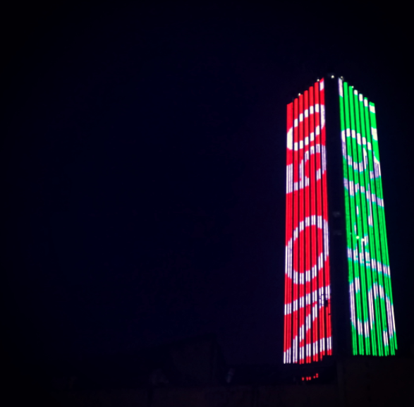

# Visualizaciones a la medida

Las visualizaciones a la medida varían mucho dependiendo de los tamaños de los objetos o espacios a intervenir. Categorizamos estos tipos de intervenciones en 3 tipos dependiendo desde qué distancia se pueden apreciar las visualizaciones para un humano cualquiera.

- Pequeño
- Mediano
- Grande

El formato a usar influye bastante en los recursos necesarios para las intervenciones.


## Formato Pequeño

Visualizations could be seen from a distance of a up to 5 meters and close range.

Some of the places you could intervene include:

- Traffic signs
- Park signals
- Fences
- Sewers
- Bus stops
- Trash bins
- Sculptures 
- Pedestrian crossings
- Benches

## Formato Mediano

Visualizations could be seen from a distance of a up to 100 meters.
You would need a ladder.
Material sizes would need to be at least 20 meters in length.

Some of the places you could intervene include:

- Fountains
- Flagpole of mast
- Long railings or fances

## Formato Grande

You would need heights equipment.
Investment could start at around 10k USD to create this visualizations.
Material sizes would need to be at least 50 meters in length.
Visualizations could be seen from a distance of a couple hundred meters.

Take this intervention of colombian artist Doris Salcedo.

```{r, echo = FALSE, message=FALSE, warning=FALSE,fig.align='center', out.width='90%',fig.cap='Doris Salcedo https://www.theguardian.com/world/2016/oct/12/colombia-war-art-project-bogota-doris-salcedo'}
knitr::include_graphics("assets/04/large_doris.png")
```


Or this visualization of the results of Colombia's peace agreeement referendum of 2016 shown in Bogota's largest building.

```{r, echo = FALSE, message=FALSE, warning=FALSE,fig.align='center', out.width='90%',fig.cap='https://www.instagram.com/p/BLFCFloDnjF/'}

```


