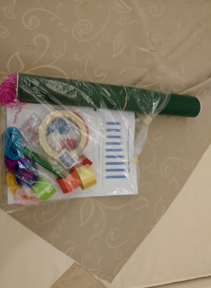
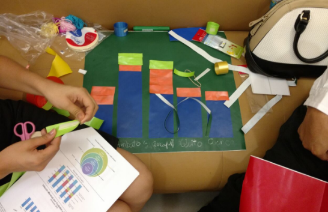

#EXPERENCIAS EN OTROS PAÍSES

Urbano es sin duda alguna una propuesta innovadora que se esfuerza por brindarle a los ciudadanos nuevas herramientas en torno a los datos, a su vez, promueve el interés por los datos abiertos y visualizarlos de una forma democrática, donde la comunidad esté involucrada y pueda interactuar con la información.

Por ello, este tipo de proyectos, muestran respuestas positivas en cuanto a ampliar la posibilidad de contribuir a actuar y reforzar prácticas e instrumentos en torno a los datos, así como fomentar la participación ciudadana en relación a temas que a todos nos competen pero que desconocemos por el formato o por la presentación de la misma información.

Urbano es por lo tanto, una plataforma interactiva para hacer intervenciones callejeras, en su primera versión, en el marco de AbreLatam (Uno de los encuentros más grandes de América Latina en torno a los datos abiertos) tuvo gran acogida. Este laboratorio de intervenciones callejeras tuvo tal éxito que otros representantes de cultura de datos abiertos en otros países de América Latina quisieron replicar esta experiencia. 

Hay que tener en cuenta que Urbano y sus instrucciones no deben tomarse como una guía rígida a seguir, sino más bien como una orientación de la propuesta. Los materiales y los kits pueden variar según la disponibilidad y oferta en cada región. 

# Ecuador- Guayaquil

*Fundapi* es una organización ecuatoriana sin ánimo de lucro que trabaja en la planeación y ejecución de iniciativas relacionadas con la comunicación y las Tecnologías de la Información, su interés radica en promover el desarrollo, el cambio social y la participación ciudadana.

Estuvimos hablando con su Director Eduardo Béjar, sobre la experiencia que tuvieron él y su equipo replicando el proyecto de Urbano en la ciudad de Guayaquil, estas son algunas de sus ideas sobre la cultura de datos abiertos y las impresiones más destacadas replicando el proyecto.

+Promover el interés de los datos abiertos y visualizaciones en la comunidad estudiantil.
+Hacer foros y eventos para promover nuevos conocimientos en la comunidad estudiantil.
+Convenio con la Universidad Espíritu Santo (UES) de Guayaquil para incentivar a la comunidad estudiantil a involucrarse en la cultura de datos abiertos.
+Las propuestas de Tecnologías de la Información con cultura de datos está muy afín a las carreras tecnológicas que se ofertan en la UES
+En Ecuador por ley los estudiantes tienen que prestar ciertas horas de vinculación y pasantías en lo social.
+Una estrategia pertinente fue vincular las pasantías que tienen que hacer los estudiantes con propuestas novedosas desde el ámbito tecnológico, ya que esto si tiene un impacto al entorno inmediato.

#Sobre Urbano:

+Potencializar lo digital a lo tangible.
Descubrir el potencial que tiene intervenir con visualizaciones el espacio público.
+Las intervenciones callejeras con visualizaciones se interesan en aportar cambios en lo social.
+Temas importantes que le competen a la comunidad estudiantil y son pertinente para visualizar: Notas, promedios, transporte, horarios, Conocer las notas de las materias, así como los promedios, saber cómo llegar a la universidad por rutas más fáciles, en un entorno donde el Uber no existe.
+El estudio y el trabajo con los datos ayuda a la interpretación de la información.
+Tocar temas urbanos, procesos de creación de aplicaciones.
+Tocar temas que como ciudadanos nos compete como: salud, transporte, seguridad.
+Sobre los Kits algunos materiales no se pudieron conseguir o eran muy costosos.
No se consiguió ningún presupuesto para los kits y los materiales, todo fue autogestionado.
+Equipos de 3 a 4 personas, en total 8 grupos.
+La replicación de Urbano se hizo por los alrededores de la Universidad Espíritu Santo (UES) en Guayaquil.
+Tuvo gran recepción y fue refrescante ver que había otro tipo de actividades en el campus universitario.
+La propuesta es novedosa.

# Algunas fotos de Urbano en Guayaquil:

# México - D.F

